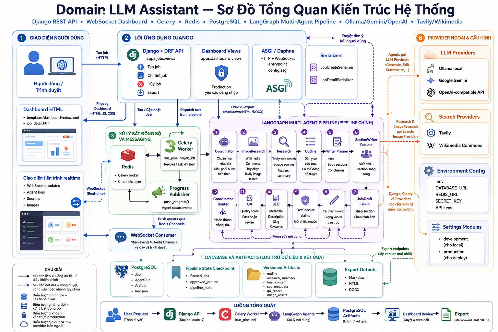

# Kien Truc He Thong

Domain LLM Assistant la he thong tao noi dung dai bang multi-agent. Cach de hieu nhanh nhat khong phai la nhin theo "layer", ma la nhin theo cac cum thanh phan va cach chung noi chuyen voi nhau: browser goi Django, Django day viec cho Celery, Celery chay LangGraph, agents goi LLM/search providers, ket qua duoc luu vao PostgreSQL va day realtime ve dashboard qua Redis Channels.

## So Do Tong Quan



## Luong Tuong Tac Chinh

```text
User / Browser
  -> Django Dashboard + DRF API
  -> PostgreSQL tao Job
  -> Redis broker
  -> Celery Worker
  -> LangGraph Multi-Agent Pipeline
  -> External Providers: LLM, Tavily, Wikimedia
  -> PostgreSQL luu AgentRun + Artifact + Revision
  -> Redis Channels
  -> WebSocket Dashboard realtime
  -> Export Markdown / HTML / DOCX
```

## Muc Do Quan Trong Cua Thanh Phan

| Muc | Thanh phan | Ly do quan trong |
| --- | --- | --- |
| P0 - Xong song | PostgreSQL | Luu `Job`, `Artifact`, `AgentRun`, `Revision`, checkpoint. Mat DB la mat trang thai pipeline va ket qua. |
| P0 - Xong song | Celery Worker + `run_pipeline` | Noi that su chay LangGraph. API chi tao job; worker moi tao noi dung. |
| P0 - Xong song | LangGraph + `PipelineState` | Dieu phoi thu tu agent, fan-out/fan-in writer, revision loop, resume sau outline review. |
| P0 - Xong song | LLM Providers | Research summary, outline, section writing, editor, fact-check, SEO, QA deu phu thuoc LLM tru mot so node planner/join. |
| P1 - Rat quan trong | Redis | Vua la Celery broker vua la Channels layer. Khong co Redis thi task va realtime progress deu hong. |
| P1 - Rat quan trong | Django DRF API | Tao job, cancel, approve outline, doc artifact, export. Day la control plane cua he thong. |
| P1 - Rat quan trong | QA + FactChecker | La quality gate. QA hien co topic-alignment gate de chan bai viet bi lech chu de. |
| P1 - Rat quan trong | Research + ImageResearch | Cung cap nguon va anh. Neu nguon sai, outline va writer se di sai theo. |
| P2 - Quan trong | Dashboard HTML + WebSocket | Giup user tao job, xem tien trinh, duyet outline, sua/export noi dung. |
| P2 - Quan trong | SEO Agent | Tao metadata, slug, keyword; quan trong cho export/publish nhung khong phai dieu kien song con cua pipeline. |
| P2 - Quan trong | Export Markdown/HTML/DOCX | Bien artifact thanh file dung duoc. Anh huong workflow cuoi, khong anh huong viec sinh noi dung. |
| P3 - Ho tro | Docs, graph export, scripts | Giup van hanh va bao tri; khong nam tren duong chay runtime chinh. |

## Cac Cum Thanh Phan

### 1. User Interface

Thanh phan:

- `templates/dashboard/index.html`
- `templates/dashboard/job_detail.html`
- `apps/dashboard/views.py`
- `apps/dashboard/consumers.py`

Vai tro:

- Hien form tao job.
- Goi REST API de tao/huy/sua/export job.
- Mo WebSocket `/ws/jobs/{job_id}/` de nhan progress realtime.
- Cho user duyet outline khi `outline_review_required=True`.

Do quan trong: P2. Neu UI hong, API va pipeline van co the chay bang REST/manual command, nhung trai nghiem user bi anh huong lon.

### 2. Django API

Thanh phan:

- `apps/jobs/views.py`
- `apps/jobs/serializers.py`
- `apps/jobs/models.py`

Vai tro:

- Validate payload bang serializer.
- Tao `Job`, gan `celery_task_id`, dispatch task sau khi DB transaction commit.
- Xu ly cancel, approve outline, regenerate section, artifact fetch, evidence, analytics, export.
- Production dung session auth/CSRF; development mo thoang de chay local.

Do quan trong: P1. Day la control plane; neu API sai thi user khong dieu khien duoc pipeline.

### 3. Redis + Celery

Thanh phan:

- Redis trong Docker.
- `config/celery.py`
- `apps/jobs/tasks.py`

Vai tro:

- Redis lam Celery broker.
- Celery worker chay `run_pipeline(job_id)`.
- Task kiem tra `cancelled` giua cac node de tranh job bi set completed sau khi user da huy.
- Khi pipeline pause/revision/complete, task cap nhat DB va gui progress event.

Do quan trong: P0/P1. Celery la P0 vi noi dung chi duoc sinh trong worker. Redis la P1 vi la broker va realtime channel layer.

### 4. LangGraph Multi-Agent Pipeline

Thanh phan:

- `apps/pipeline/graph.py`
- `apps/pipeline/state.py`
- `apps/pipeline/quality.py`
- `apps/agents/*`

Vai tro:

- `PipelineState` la hop du lieu chung chay qua moi agent.
- Coordinator chuan hoa input va router revision.
- ImageResearch tim anh, Research lay nguon, Outline lap dan y.
- Writer chia task, SectionWriter fan-out viet song song, JoinDraft fan-in ghep bai.
- Editor sua van phong, FactChecker kiem claim, SEO tao metadata, QA quyet dinh pass/revise.

Do quan trong: P0. Day la trai tim xu ly noi dung.

### 5. PostgreSQL Data Store

Thanh phan:

- `Job`: input, status, usage, checkpoint.
- `AgentRun`: log tung node/agent.
- `Artifact`: output theo version.
- `Revision`: lich su vong sua.

Vai tro:

- Luu dau vao va trang thai job.
- Luu artifact moi nhat va lich su artifact cu.
- Luu `pipeline_state` de resume sau outline review.

Do quan trong: P0. Khong co DB thi he thong khong co bo nho.

### 6. External Providers

Thanh phan:

- Ollama local.
- Google Gemini.
- OpenAI-compatible local server.
- Tavily search.
- Wikimedia Commons.

Vai tro:

- LLM providers sinh structured output/noi dung.
- Tavily lay web evidence va image fallback.
- Wikimedia la nguon anh uu tien vi URL anh on dinh hon va co metadata license ro hon.

Do quan trong: P0/P1. LLM la P0 cho chat luong noi dung. Search/image providers la P1 vi co fallback, nhung khong co chung bai se kem evidence/visual hon.

## Nhung Diem Can Nho Khi Bao Tri

- Topic cua user phai la trung tam. Domain guide chi bo sung ngu canh, khong duoc thay the topic.
- Neu bai bi lech topic, sua `Research`, `Outline`, `QA` truoc khi sua `Editor`.
- Neu job bi ket/huy sai, xem `apps/jobs/tasks.py`, Celery worker, Redis va status trong `Job`.
- Neu dashboard khong realtime, kiem tra Redis channel layer, `apps/dashboard/consumers.py`, va ASGI/Daphne.
- Neu anh khong hien thi, uu tien kiem tra `ImageResearch`: host co bi chan hotlink khong, content-type co phai `image/*` khong, URL co phai direct image URL khong.
- Neu export lay noi dung cu, kiem tra artifact versioning va order by `-version`, `-created_at`.
