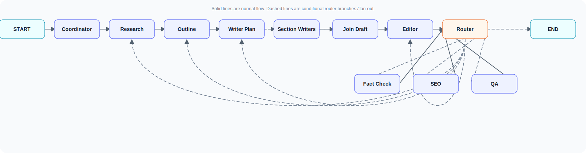
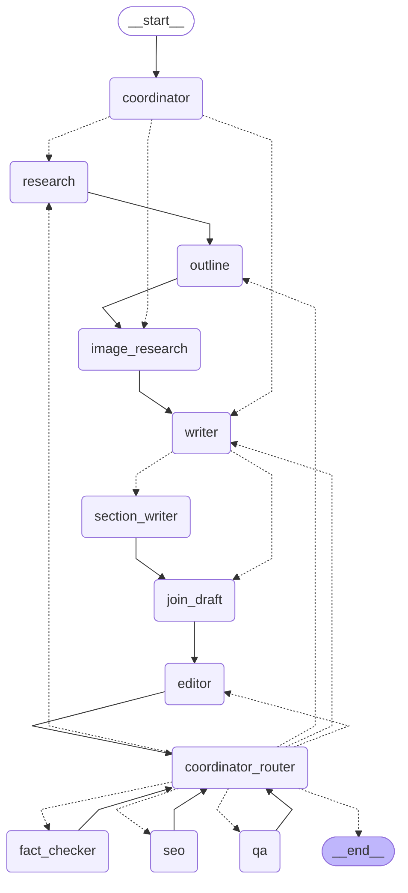

# Current LangGraph Pipeline

Mermaid source in [pipeline-graph.mmd](./pipeline-graph.mmd) is the canonical graph. The checked-in SVG is a static preview.

```mermaid
---
config:
  flowchart:
    curve: linear
---
graph TD;
	__start__([<p>__start__</p>]):::first
	coordinator(coordinator)
	research(research)
	outline(outline)
	image_research(image_research)
	writer(writer)
	section_writer(section_writer)
	join_draft(join_draft)
	editor(editor)
	coordinator_router(coordinator_router)
	fact_checker(fact_checker)
	seo(seo)
	qa(qa)
	__end__([<p>__end__</p>]):::last
	__start__ --> coordinator;
	editor --> coordinator_router;
	fact_checker --> coordinator_router;
	image_research --> writer;
	join_draft --> editor;
	outline --> image_research;
	qa --> coordinator_router;
	research --> outline;
	section_writer --> join_draft;
	seo --> coordinator_router;
	coordinator -.-> research;
	coordinator -.-> image_research;
	coordinator -.-> writer;
	writer -.-> section_writer;
	writer -.-> join_draft;
	coordinator_router -.-> research;
	coordinator_router -.-> outline;
	coordinator_router -.-> writer;
	coordinator_router -.-> editor;
	coordinator_router -.-> fact_checker;
	coordinator_router -.-> seo;
	coordinator_router -.-> qa;
	coordinator_router -.-> __end__;
	classDef default fill:#f2f0ff,line-height:1.2
	classDef first fill-opacity:0
	classDef last fill:#bfb6fc

```
